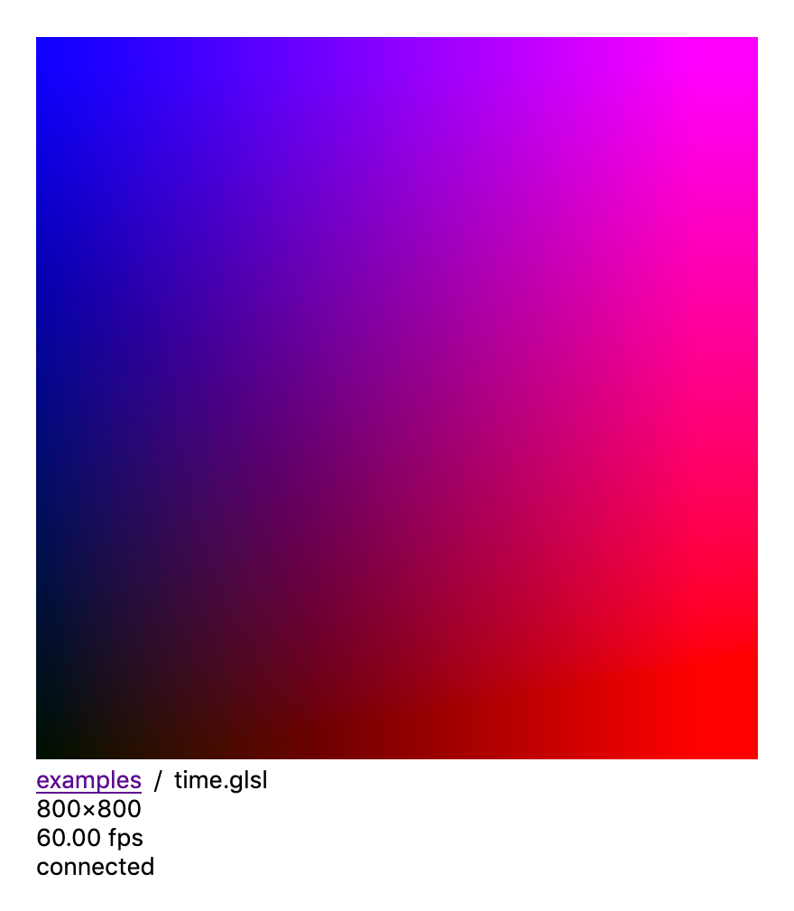

`shaded` is a development tool for writing and previewing glsl fragment shaders,
in the spirit of:

- [The Book of Shaders editor](http://editor.thebookofshaders.com)
- [Shadertoy](https://www.shadertoy.com/)
- [GLSLbin](http://glslb.in/)
- [GLSL Sandbox](http://glslsandbox.com)
- [atom-glsl-preview](https://atom.io/packages/glsl-preview)
- [vscode-glsl-canvas](https://marketplace.visualstudio.com/items?itemName=circledev.glsl-canvas)


#### Features

1. Bring your own text editor.

2. Run your shader while you code, with hot reloading on save.

3. Share and reuse code with [glslify](https://github.com/glslify/glslify):

   ```glsl
   #pragma glslify: noise = require('glsl-noise/simplex/2d')
   #pragma glslify: smoothUnion = require('./smoothUnion')
   ```

4. Built in uniforms (compatible with The Book of Shaders):

   ```glsl
   uniform vec2 u_resolution;
   uniform vec2 u_mouse;
   uniform float u_time;
   ```

5. Texture loading by comment:

   ```glsl
   uniform sampler2D bump; // ../textures/brick_wall.jpg
   ```

All of these features are available in
[atom-glsl-preview](https://atom.io/packages/glsl-preview), but I switched from
Atom to VSCode a while back, so I wanted to be able to write shaders in any text
editor.
[vscode-glsl-canvas](https://marketplace.visualstudio.com/items?itemName=circledev.glsl-canvas)
is pretty great, but doesn't support glslify or simple texture loading. Instead
of tying myself to a particular editor, I decided to write a more generic tool
that simply worked with my file system and a browser.

NOTE:
If you're coming from atom-glsl-preview, the behavior of `u_mouse` has changed:
instead of providing normalized mouse coordinates (0 to 1), `u_mouse` will match
the coordinates of `gl_FragCoord` (divide by `u_resolution` to get back to
normalized coordinates). This makes the behavior match that of The Book of
Shaders editor.

As in recent versions of atom-glsl-preview, no `precision` specifiers or
uniform declarations will be added to your shader automatically—what you code is
what you get.

#### Install

[](https://www.npmjs.com/package/shaded)

    npm install --global shaded

Or, with `yarn`:

    yarn global add shaded


#### Usage

Start the server in the current directory:

    $ shaded
    shaded listening at http://localhost:3000

Open http://localhost:3000 in your browser to see a listing of the files in the
current directory. Navigating to a file ending with the extension `.glsl` will
open a page showing the shader in a WebGL canvas.




#### Examples

- [`/examples`](examples/) in this repository
- https://fordhurley.com/shaders
- https://github.com/fordhurley/shaders


#### TODO

- More testing (especially cross platform/browser).
- Show/copy original source and "compiled" (glslified) source.
- Show line errors when viewing source.
- Custom file extensions.
- Open browser to a specific file/directory if named as an argument.
- Browse "gallery" with previews.
- Play/pause controls.
- Export frames/video.
- Custom uniform sliders.
- Custom programmable uniforms (e.g. mouse clicks, keyboard, date).
- Video textures.
- Multiple buffers.
